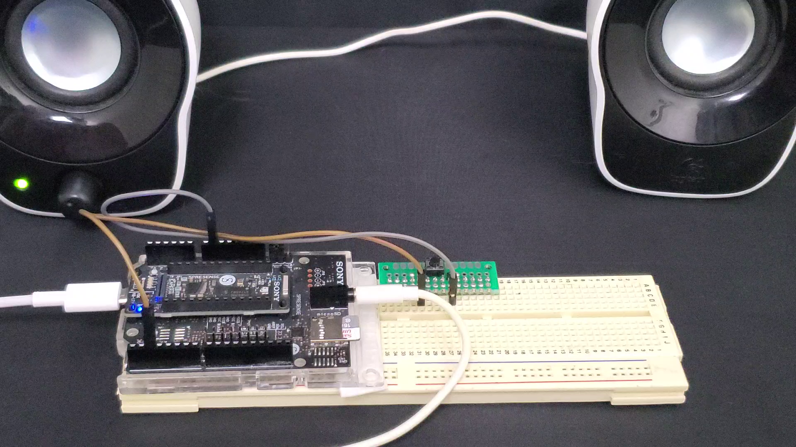
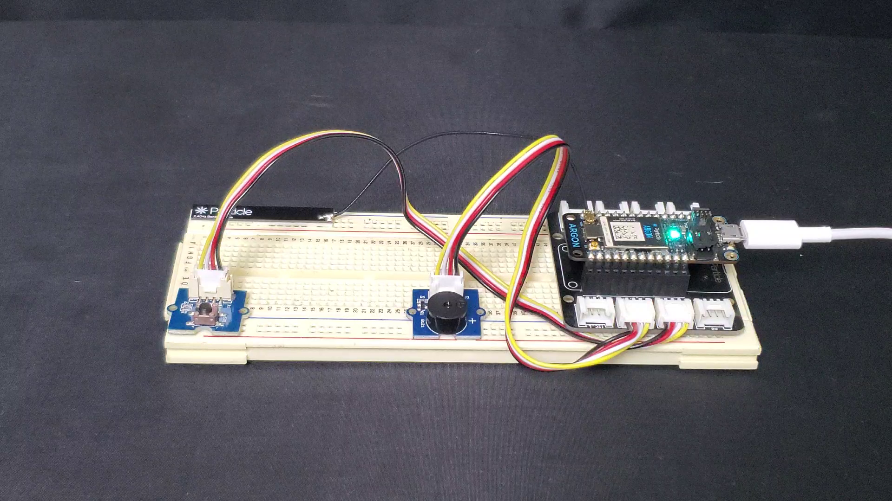
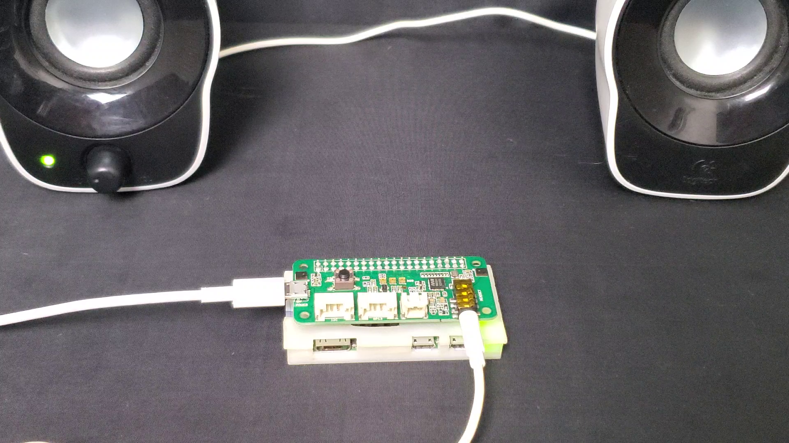
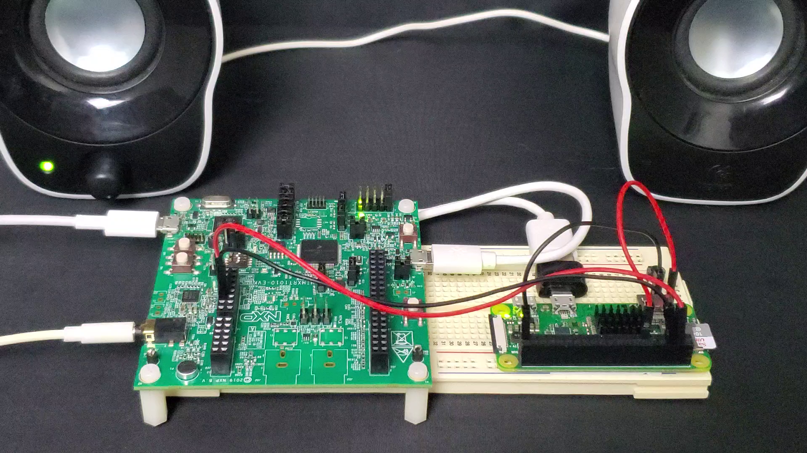
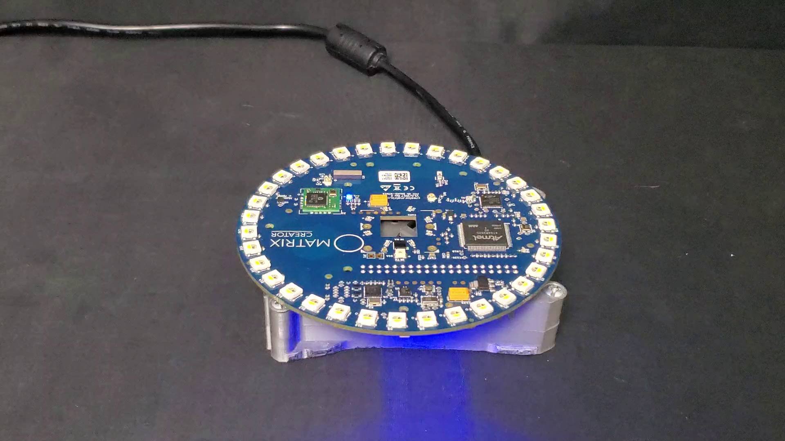

# Devices Source Code:

- [Devices Source Code:](#devices-source-code)
  - [Spresense:](#spresense)
  - [Argon Particle:](#argon-particle)
  - [RPi Zero:](#rpi-zero)
  - [MIMXRT1010-EVK:](#mimxrt1010-evk)
  - [RPi Matrix:](#rpi-matrix)

## Spresense:

[Spresense](https://developer.sony.com/develop/spresense/)

[Source-Code](https://github.com/altaga/Micro-Band/tree/main/Digimon/Spresense)

[Individual-Demo](https://youtu.be/d1cNzhIahX4)

## Argon Particle:

[Argon](https://docs.particle.io/argon/)

[Source-Code](https://github.com/altaga/Micro-Band/tree/main/Digimon/Argon%20Particle)

[Individual-Demo](https://youtu.be/bhy4bjGC_68)

## RPi Zero:

[RPi-Zero](https://www.raspberrypi.org/products/raspberry-pi-zero-w/)

[Source-Code](https://github.com/altaga/Micro-Band/tree/main/Digimon/RPi%20Zero%20-%20ReSpeaker)

[Individual-Demo](https://youtu.be/PAg-TMxD9dg)

## MIMXRT1010-EVK:

[MIMXRT1010-EVK](https://www.nxp.com/design/development-boards/i-mx-evaluation-and-development-boards/i-mx-rt1010-evaluation-kit:MIMXRT1010-EVK)

[Source-Code](https://github.com/altaga/Micro-Band/tree/main/Digimon/MIMXRT1010-EVK)

[Individual-Demo](https://youtu.be/TkAksPad-WI)

## RPi Matrix:

[Matrix-Creator](https://store.matrix.one/products/matrix-creator)

[Source-Code](https://github.com/altaga/Micro-Band/tree/main/Digimon/RPi4%20Matrix)

[Individual-Demo](https://youtu.be/h5CevAw1AU8)